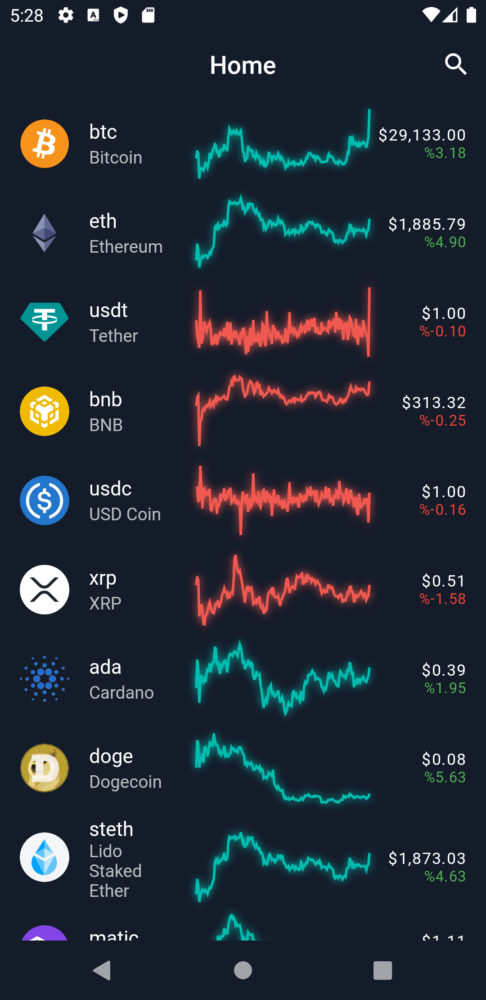
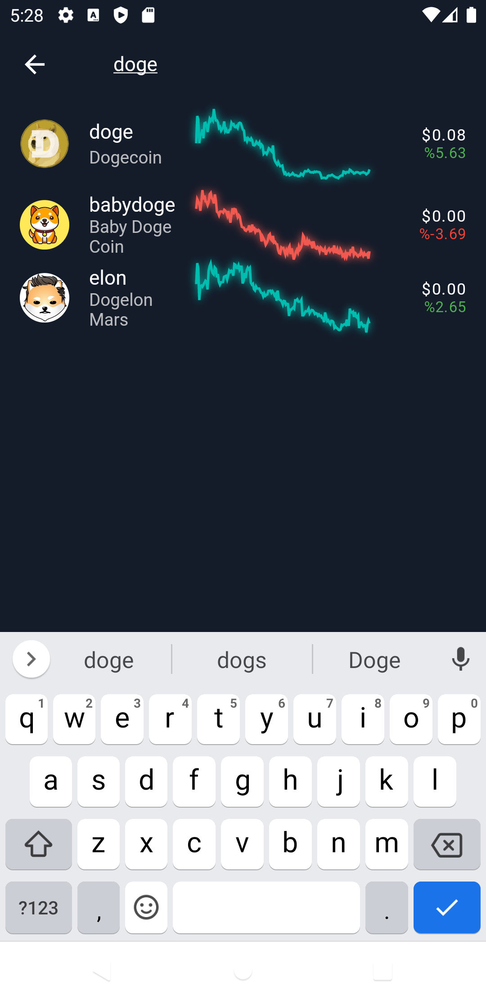
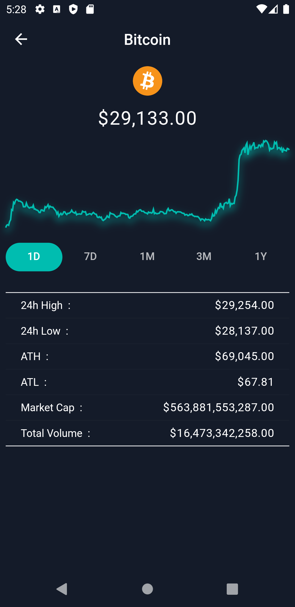
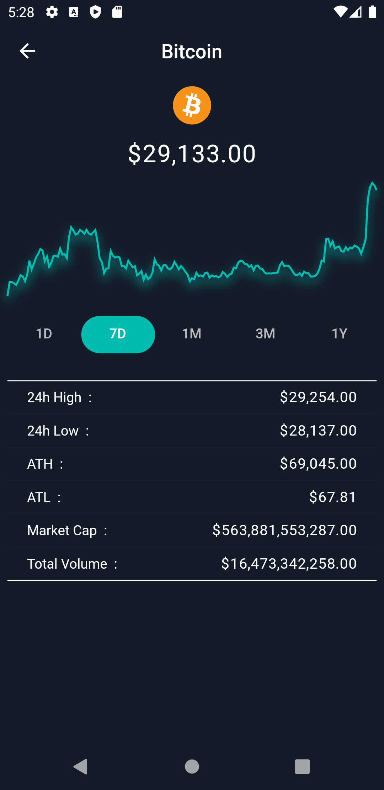
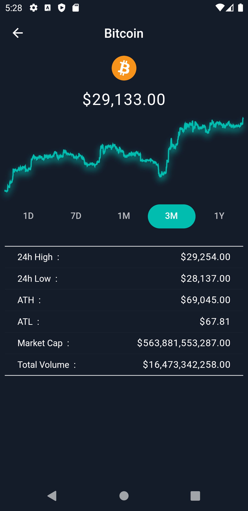
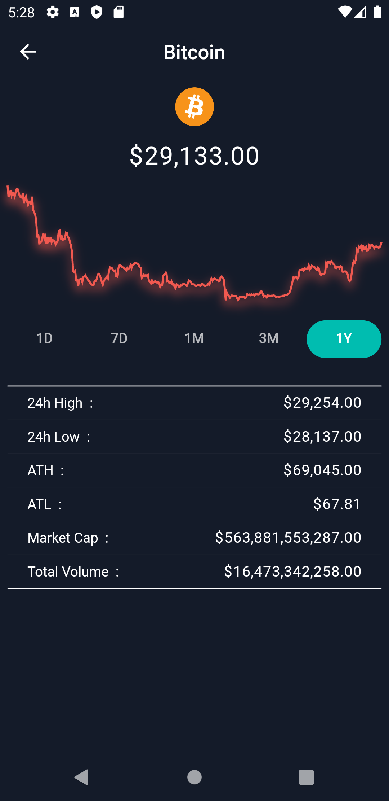

# CryptoCurrency

- CryptoCurrency App.

# Features

- Get all coins data.
- Search any coin.
- View 1d,7d,1m,3m and 1 year historical data.

# Tech

- State Management : [BLoC](https://pub.dev/packages/flutter_bloc)
- Charts : [FL Chart](https://pub.dev/packages/fl_chart)
- API : [CoinGecko](https://www.coingecko.com/tr/api/documentation)

## Preview

<table>
  <tr align = "center">
    <td colspan="5"> Preview Video </td>
  </tr>
  <tr> 
    <td></td>
  </tr>
  <tr align = "center">
   <td colspan="5"> Home Screen / Search Screen </td>
  </tr>
  <tr align = "center">
  <td></td>
  <td></td>
  </tr>
  <tr align = "center">
   <td colspan = "5"> Detail Screen </td>
  </tr>
  <tr align = "center">
  <td></td>
  <td></td>
  <td></td>
  <td></td>
  <td></td>
  </tr>
</table> 

